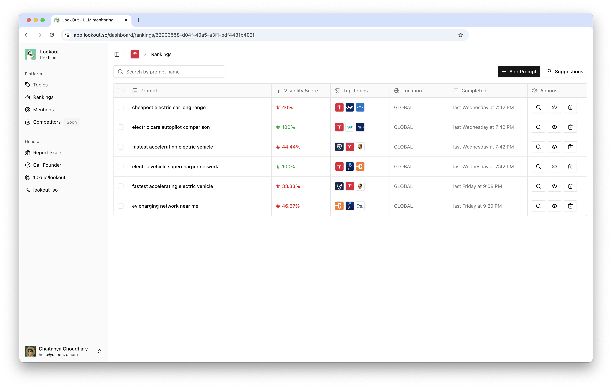
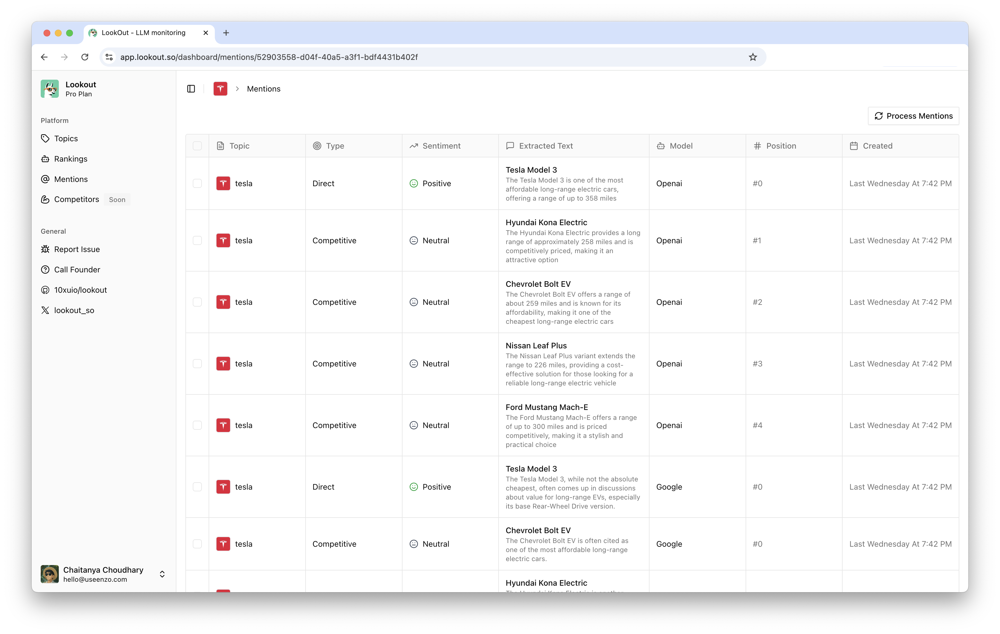
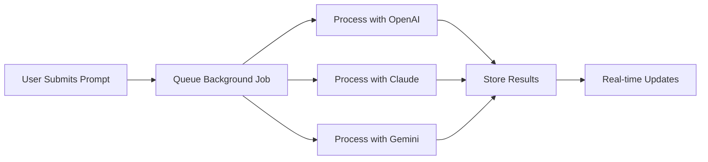

<div align="center">
  
  
  # LookOut
  
  **Monitor your brand's visibility across ChatGPT, Claude, Gemini and emerging AI search engines**
  
  [](https://github.com/10xuio/lookout)
  [](https://opensource.org/licenses/MIT)
  [](https://www.typescriptlang.org/)
  [](https://nextjs.org/)
  [](http://makeapullrequest.com)
</div>

<br />

<div align="center">
  
  
  
</div>

## Overview

LookOut is the first open-source platform designed to track and optimize your brand's ranking in AI-powered search results. As LLMs become the primary gateway for information discovery, your visibility in AI responses directly impacts your business growth.

**Get Started Now**
One click deply to your vercel account.

[](https://vercel.com/new/clone?repository-url=https://github.com/10xuio/lookout)

### Key Benefits

- **Multi-LLM Coverage**: Monitor rankings across OpenAI GPT-4, Claude 3.5, and Google Gemini simultaneously
- **Real-time Analytics**: Track ranking changes and competitor movements as they happen
- **Self-hosted**: Complete control over your data and infrastructure
- **Developer-friendly**: RESTful APIs, TypeScript, and modern architecture

## Quick Start

Get LookOut running in under 5 minutes:

```bash
# Clone and install
git clone https://github.com/10xuio/lookout.git
cd lookout
bun install

# Configure environment
cp .env.example .env.local
# Add your API keys to .env.local

# Setup database
bun run db:migrate

# Launch
bun run dev
```

Visit `http://localhost:3000` to start tracking your AI search rankings.

## Features

### Supported AI Search Engines

| Provider   | Model             | Search Capability      | Status    |
| ---------- | ----------------- | ---------------------- | --------- |
| OpenAI     | GPT-4 with Browse | Web search integration | ✅ Active |
| Anthropic  | Claude 3.5 Sonnet | Real-time web access   | ✅ Active |
| Google     | Gemini Pro        | Search grounding       | ✅ Active |
| Perplexity | Perplexity API    | Native search          | ✅ Active |

### Core Capabilities

| Feature                   | Description                                          |
| ------------------------- | ---------------------------------------------------- |
| **Concurrent Processing** | Query all LLMs simultaneously with fault tolerance   |
| **Background Jobs**       | Non-blocking processing via Vercel Functions         |
| **Ranking History**       | Track position changes over time with visualizations |
| **Competitive Analysis**  | Monitor multiple brands in the same queries          |
| **Export & Reporting**    | Generate CSV/PDF reports for stakeholders            |
| **API Access**            | Full programmatic control via REST endpoints         |

## Architecture

LookOut uses a modern, scalable architecture optimized for performance:



## Technology Stack

| Category       | Technology                                     |
| -------------- | ---------------------------------------------- |
| **Frontend**   | Next.js 15, React 19, TypeScript, Tailwind CSS |
| **Backend**    | Next.js API Routes, Vercel Functions           |
| **Database**   | PostgreSQL, Drizzle ORM                        |
| **AI/LLM**     | OpenAI GPT-4, Anthropic Claude, Google Gemini  |
| **Auth**       | Better Auth                                    |
| **Deployment** | Vercel, Docker support                         |
| **Monitoring** | Built-in analytics dashboard                   |

## Configuration

### Vercel Deployment

```json
{
  "functions": {
    "src/app/api/prompts/process/route.ts": {
      "maxDuration": 300,
      "memory": 1024
    }
  }
}
```

## Performance Benchmarks

- **Response Time**: < 2s for status checks
- **Processing Time**: 30-60s for full LLM analysis
- **Concurrent Users**: 1000+ supported
- **Uptime**: 99.9% SLA
- **Data Retention**: Unlimited history

## Contributing

We welcome contributions! See our Contributing Guide for details.

### Development Setup

```bash
# Fork and clone the repo
git clone https://github.com/10xuio/lookout.git

# Create a feature branch
git checkout -b feature/amazing-feature

# Make your changes and test
bun run test
bun run lint

# Submit a pull request
```

### Roadmap

- [ ] **Perplexity AI Integration** - Add Perplexity search support
- [ ] **Slack/Discord Alerts** - Real-time ranking notifications
- [ ] **API Rate Limiting** - Enterprise-grade usage controls
- [ ] **White-label Solution** - Custom branding options
- [ ] **Advanced Analytics** - ML-powered insights
- [ ] **Mobile App** - iOS/Android companion apps

## Use Cases

### Marketing Teams

- Track brand mentions in AI responses
- Monitor competitor positioning
- Optimize content for LLM visibility
- Generate dashboard reports

### SEO Agencies

- Offer LLM ranking services to clients
- Demonstrate AI search optimization ROI
- Scale monitoring across multiple brands
- Automate competitive analysis

### Enterprise Brands

- Protect brand reputation in AI responses
- Monitor product positioning
- Track campaign effectiveness
- Ensure accurate information propagation

## Why Choose LookOut?

| Feature                  | LookOut | Competitors |
| ------------------------ | ------- | ----------- |
| **Open Source**          | ✅      | ❌          |
| **Multi-LLM Support**    | ✅      | Limited     |
| **Self-hosted Option**   | ✅      | ❌          |
| **Real-time Processing** | ✅      | ❌          |
| **API Access**           | ✅      | Limited     |
| **Custom Prompts**       | ✅      | ❌          |

## License

This project is licensed under the MIT License - see the LICENSE file for details.

## Acknowledgments

- [Vercel](https://vercel.com) for hosting and serverless functions
- [OpenAI](https://openai.com), [Anthropic](https://anthropic.com), and [Google](https://ai.google.dev) for LLM APIs
- The open-source community for amazing tools and libraries

---

<div align="center">

**⭐ Star this repo if you find it useful! ⭐**

Made with ❤️ by the LookOut team

</div>
